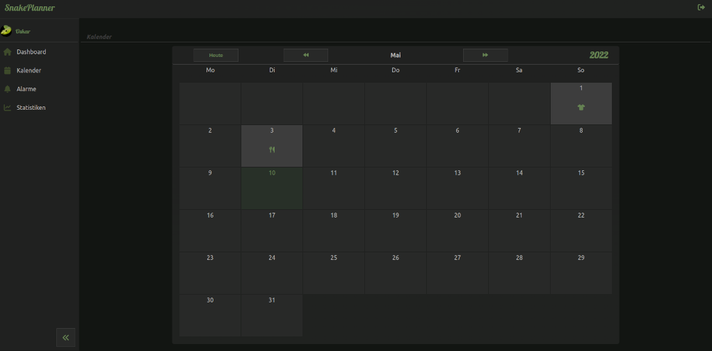

# SnakePlanner Backend



This is the API for the [SnakePlanner App](https://snakeplanner.azurewebsites.net).
It is built with the awesome [Quarkus](https://quarkus.io) Java Framework and [AstraDB](https://astra.datastax.com) as DBaaS. 
The Frontend Repo can be found [here](https://github.com/oldrover/snakeplanner-frontend).

## Description

With SnakePlanner you are able to create an account and organize your snakes and its events like shedding, feeding etc.
It is still in an early stage of developement and so far it offers just a basic functionality.

Some goals for the near future are :

- email alerts for feeding on regular basis
- statistics for size and weight

## Prerequisites

For running this App locally you need:

- JDK 11+ installed
- Apache Maven 3.5.3+
- A running [DataStax Astra](https://astra.datastax.com) database
- A PublicKey and PrivateKey for JWT 

For further Information on configuration for DB access and JWT keys, please refer to these references:

- [Cassandra Quarkus quickstart guide](https://github.com/datastax/cassandra-quarkus/tree/main/quickstart)
- [Quarkus guide: Using JWT RBAC](https://quarkus.io/guides/security-jwt)

## Running the application in dev mode


You can run your application in dev mode that enables live coding using:
```shell script
./mvnw clean quarkus:dev
```

Then you can visit `http://localhost:8080/swagger` for the API documentation and schemas.


## Attaching the frontend to the project

For cloning the frontend to its specific folder run:

```
git submodule sync
```
and then:
```
git submodule update --init --remote --recursive
```


## Packaging the application

Be sure the frontend-submodule was cloned to `src/main/snakeplanner-frontend`.   

The application can be packaged using:
```shell script
./mvnw package
```

It builds the frontend and copies it to the `META-INF/resources` folder and then produces the `quarkus-run.jar` file in the `target/quarkus-app/` directory.
Be aware that it’s not an _über-jar_ as the dependencies are copied into the `target/quarkus-app/lib/` directory.

The application is now runnable using `java -jar target/quarkus-app/quarkus-run.jar`.

## Dockerizing the application

After packaging you can dockerize the application with:
```shell script
docker build -f src/main/docker/Dockerfile.jvm -t quarkus/snakeplanner_backend-jvm .
```
Then add a .env file with your secrets like this:
```shell script
CASSANDRA_USERNAME=your_username
CASSANDRA_PASSWORD=your_password
CASSANDRA_KEYSPACE=your_keyspace
```
and then run the container using:
``` 
docker run -i --rm -p 8080:8080 --env-file=.env quarkus/snakeplanner_backend-jvm
```


